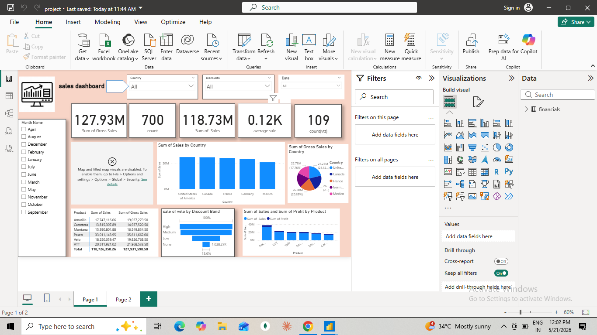

# Sales Performance Dashboard

## 📊 Project Overview
An interactive Power BI dashboard designed to analyze regional sales performance, track core commercial KPIs, and identify revenue trends over time.

### 🖼️ Dashboard Preview

## 🛠️ Key Features & Insights
* **Dynamic KPIs**: Tracks Sales Revenue, Profit Margin, and Total Units Sold.
* **Interactive Slicers**: Filter views instantly by Region, Product Category, and Year/Quarter.
* **Performance Analysis**: Visualizes MoM (Month-over-Month) sales trends and identifies top-performing sales territories.

## 🧰 Tech Stack
* **Tool**: Microsoft Power BI Desktop
* **Data Transformations**: Power Query (ETL, data cleaning, datatype formatting)
* **Modeling**: DAX (Data Analysis Expressions) for custom measures and calculated columns
